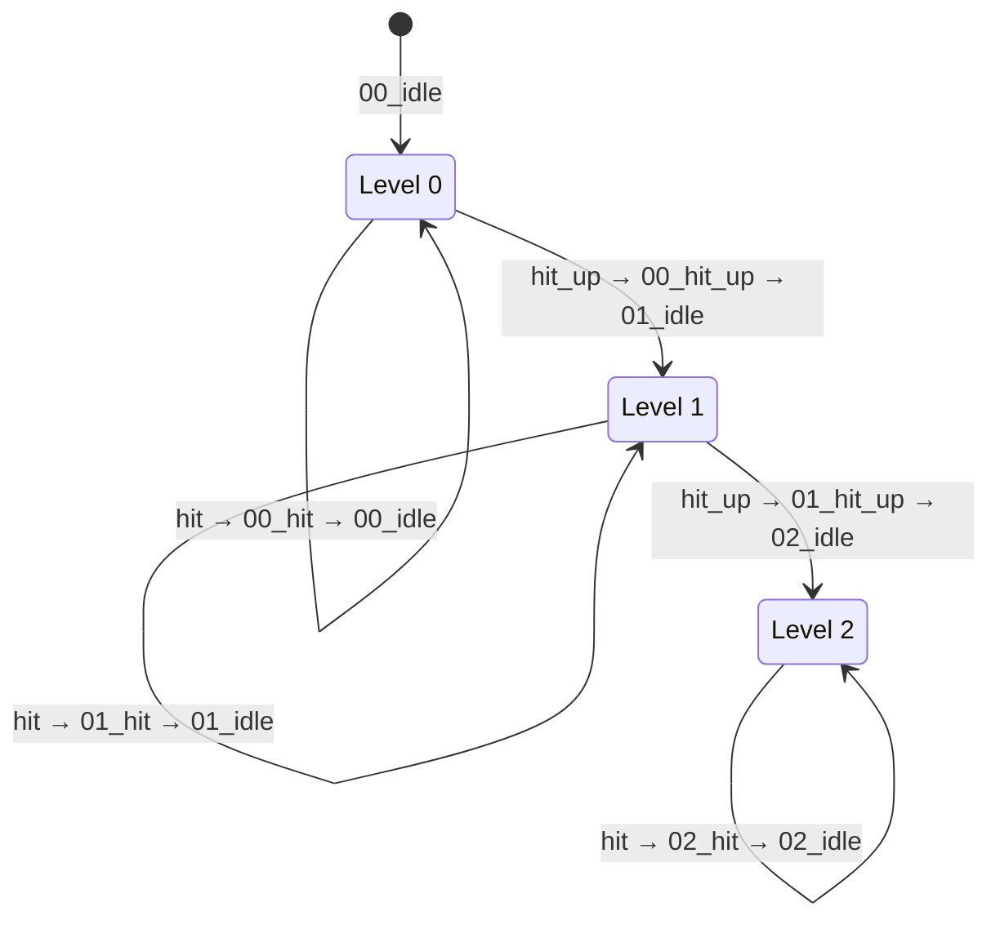

# ChestManager - Система управления сундуками

Модуль для управления Spine-экземплярами сундуков с системой уровней и анимаций реакций.

## Возможности

- Три сундука с разными скинами (red, blue, yellow)
- Система уровней (0, 1, 2 — обычная игра)
- Анимации реакций на прилёт монеток (hit, hit_up)
- Анимация реакции на взрыв бомбы (jump)
- Автоматический переход между уровнями

## Система уровней

### Структура анимаций (трек 0)

Каждый уровень имеет свой набор анимаций с префиксом:

| Уровень | Idle (loop) | Hit | Hit Up | Jump | Boom |
|---------|-------------|-----|--------|------|------|
| 0 | 00_idle | 00_hit | 00_hit_up | 00_jump | 00_boom |
| 1 | 01_idle | 01_hit | 01_hit_up | 01_jump | 01_boom |
| 2 | 02_idle | 02_hit | — | 02_jump | 02_boom |
| 3 | 03_idle | 03_hit | — | 03_jump | 03_boom |

**Уровень 3** — открытый сундук (бонусная игра). Переход в бонус: через boom-анимацию (при переходе из обычной игры) или сразу при загрузке бонусного сценария (см. ниже).

### Диаграмма состояний



### Логика реакций

При прилёте монетки к сундуку (`onCoinArrival`):
- **hit** (~88%) — проигрывает `XX_hit`, затем возврат к `XX_idle`
- **hit_up** (~12%) — проигрывает `XX_hit_up`, уровень++, затем `(XX+1)_idle`
- На уровне 2 всегда `hit` (выше не поднимаемся в обычной игре)

При взрыве бомбы (`playBombBoomReaction`):
- **Жёлтый сундук в бонусной игре**, если он активен (`activeChests` включает `'yellow'`): проигрывает **03_boom**, затем 03_idle (правило только для жёлтого, только в бонусе, только если активен).
- Остальные сундуки и жёлтый в остальных случаях: проигрывает `XX_jump` текущего уровня, затем `XX_idle`.

## Быстрый старт

### 1. Импорт

```javascript
import { 
  createAllChests, 
  playJumpOnAll, 
  onCoinArrival,
  getChestLevel,
  resetChestLevels 
} from './ChestManager.js';
```

### 2. Создание сундуков

```javascript
// Загрузка ассетов
await PIXI.Assets.load([
  { alias: 'chestSkeleton', src: 'spine/chest/skeleton.json' },
  { alias: 'chestAtlas', src: 'spine/chest/skeleton.atlas' }
]);

// Создание всех трёх сундуков
const chests = createAllChests('chestSkeleton', 'chestAtlas');

// Позиционирование и добавление на сцену
chests.red.x = 200;
chests.red.y = 500;
app.stage.addChild(chests.red);
// ... аналогично для blue и yellow
```

### 3. Интеграция с ScatterFlySystem

В регулярной игре при прилёте монетки вызывается `onCoinArrival`. В бонусной игре монетки летят в индикатор фриспинов (см. [SCATTER_FLIGHT_SYSTEM.md](SCATTER_FLIGHT_SYSTEM.md)), в сундуки не прилетают.

```javascript
const scatterFlySystem = new ScatterFlySystem(app, {
  onFlightComplete: (target) => {
    if (target === 'freespins') {
      grid.incrementFreeSpins();
      return;
    }
    onCoinArrival(chests, target);
  }
});
scatterFlySystem.setChests(chests);
scatterFlySystem.setFreeSpinsTarget(bonusFreespinsContainer); // для бонусной игры
scatterFlySystem.config.getBonusState = () => ({ isBonus: grid.isBonusFromScenario, activeChests: grid.activeChestsForBonus });
await scatterFlySystem.init();
```

### 4. Интеграция с CascadeManager (взрыв бомбы)

```javascript
const cascadeManager = new ScenarioCascadeManager(app, container, {
  // ... другие параметры
  onBombBoom: () => playBombBoomReaction(chests, {
    isBonus: grid?.isBonusFromScenario ?? false,
    activeChests: grid?.activeChestsForBonus ?? []
  })
});
```

Жёлтый сундук в бонусной игре при активном `activeChests` реагирует на взрыв анимацией 03_boom.

## API

### Создание

```javascript
// Создать один сундук с заданным скином
createChest(skeletonAlias, atlasAlias, skinName = 'red')
  → spine.Spine | null

// Создать все три сундука
createAllChests(skeletonAlias, atlasAlias)
  → { red: spine.Spine, blue: spine.Spine, yellow: spine.Spine }
```

### Реакции

```javascript
// Обработка прилёта монетки (вызывается из ScatterFlySystem)
onCoinArrival(chests, chestColor: 'red' | 'blue' | 'yellow')

// Реакция на взрыв бомбы: жёлтый в бонусе при activeChests — 03_boom, остальные — XX_jump
playBombBoomReaction(chests, { isBonus, activeChests })

// Упрощённый вызов (jump на всех, без правила для жёлтого)
playJumpOnAll(chests)
```

### Управление состоянием

```javascript
// Получить текущий уровень сундука
getChestLevel(chestColor: 'red' | 'blue' | 'yellow')
  → number (0–3)

// Сбросить уровни всех сундуков в 0
resetChestLevels()

// Установить сундуки на уровень 3 (бонус) без boom — при загрузке бонусного сценария
setChestsToBonusLevel(chests, chestColors: string[])
```

### Связь с бонусным сценарием

В сценарии фриспина первый шаг `bonus-init` содержит поле **`activeChests`** (массив цветов, например `["yellow"]`). Это означает: **в начале бонусной игры эти сундуки уже находятся на 3 уровне** (открытый сундук). При загрузке такого сценария нужно вызвать `setChestsToBonusLevel(chests, activeChests)`, чтобы отобразить сундуки в состоянии 03_idle без проигрыша boom.

**Затемнение неактивных сундуков:** в бонусной игре сундуки, не входящие в `activeChests`, всегда затемнены через **ColorMatrixFilter** (brightness 0.4), как не-выигрышные символы в `Symbol.setDimmed`. Alpha для сундуков не меняется. Применяется при каждом обновлении бонус-UI (`onBonusModeChange`).

## Конфигурация

| Константа | Значение | Описание |
|-----------|----------|----------|
| `MAX_REGULAR_LEVEL` | 2 | Максимальный уровень обычной игры |
| `HIT_UP_CHANCE` | 0.12 | Шанс перехода на следующий уровень (12%) |

## Требуемые ассеты

```
spine/chest/
├── skeleton.json
├── skeleton.atlas
└── skeleton.png
```

**Скины:** `red`, `blue`, `yellow`

**Анимации:** `00_idle`, `00_hit`, `00_hit_up`, `00_jump`, `00_boom`, `01_idle`, `01_hit`, `01_hit_up`, `01_jump`, `01_boom`, `02_idle`, `02_hit`, `02_jump`, `02_boom`, `03_idle`, `03_hit`, `03_jump`, `03_boom`

## Маппинг цветов (Scatter → Chest)

| scatterType | chestColor |
|-------------|------------|
| `blue` | `blue` |
| `gold` | `yellow` |
| `red` | `red` |

Маппинг выполняется в `ScatterFlySystem._resolveChestColor()`.

## Планы на будущее

- **Уровень 3 (бонусная игра):** Переход через `XX_boom` анимацию
- **boom анимации:** Выигрышная анимация, активирующая бонусную игру
- **Сброс при новом спине:** Интеграция `resetChestLevels()` с началом новой игры
