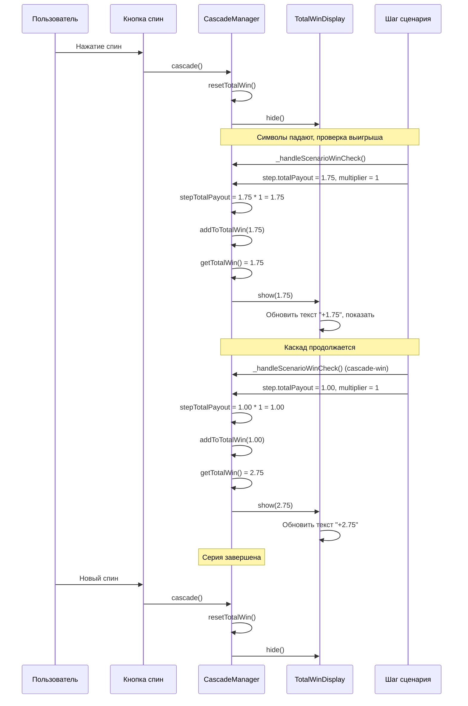

# Показ Total Win — логика и тайминги

## Терминология

- **Total Win**: накапливаемая на клиенте общая сумма выигрыша за серию каскадов (спин → каскады). Показывается игроку пока идут спины/серия каскадов.
- **Мини тотал**: сумма за **один** каскад (один шаг). Реализован в [MiniWinManager.js](slots/slot_5/MiniWinManager.js) по [MINI_WIN_DISPLAY.md](slots/slot_5/MINI_WIN_DISPLAY.md). **Логику мини винов и мини тотала не трогать.**

## Когда показывается Total Win

Total Win показывается **синхронно с мини винами** — в момент появления мини вина отображается текущая накопленная сумма за серию.

### События выигрыша

| Событие | Когда показывается | Что показывается |
|---------|-------------------|------------------|
| `spin-win` (1 комбинация) | В момент показа мини вина | WIN = накопленное значение (первый выигрыш в серии) |
| `spin-win` (2+ комбинации) | В момент показа мини вина | WIN = накопленное значение (сумма всех комбинаций спина с учётом бомбы) |
| `cascade-win` | В момент показа мини вина | WIN = накопленное значение (предыдущие спин/каскады + новый выигрыш) |

## Источник данных

### Из сценария (готовые значения)

| Данные | Поле сценария | Описание |
|--------|---------------|----------|
| Базовая сумма выигрыша | `step.totalPayout` | Сумма всех комбинаций за данный шаг |
| Множитель бомбы | `step.multiplier` | Множитель бомбы (если есть, иначе отсутствует или равен 1) |

### Вычисление на клиенте

1. **Итоговая сумма шага с учётом бомбы:** `step.totalPayout * (step.multiplier || 1)` — умножение бомбой делаем на клиенте.
2. **Накопленная сумма за серию каскадов:** суммируем все итоговые суммы шагов от начала спина до текущего каскада — это и есть Total Win, который показываем игроку.

**Пример:**
- Спин: `step.totalPayout = 1.75`, `step.multiplier = 1` → итог шага = `1.75 * 1 = 1.75`, Total Win = `1.75`.
- Каскад 1: `step.totalPayout = 1.00`, `step.multiplier = 1` → итог шага = `1.00 * 1 = 1.00`, Total Win = `1.75 + 1.00 = 2.75`.
- Каскад 2 с бомбой: `step.totalPayout = 1.25`, `step.multiplier = 5` → итог шага = `1.25 * 5 = 6.25`, Total Win = `2.75 + 6.25 = 9.00`.

## Моменты обновления Total Win

### 1. Сброс Total Win (начало новой серии)

**Когда:** В начале метода `cascade()` ([CascadeManager.js](slots/slot_5/CascadeManager.js)), **только если не бонусная игра** (`!this.isBonusFromScenario`).

**Логика:**
- **Обычная игра:** при каждом спине — `resetTotalWin()` и `totalWinDisplay.hide()`; тотал обнуляется на каждый спин.
- **Бонусная игра (фриспины):** тотал **не** сбрасывается между спинами — копится на весь бонусный раунд; сброс не вызывать.

### 2. Показ и обновление Total Win (события выигрыша)

**Когда:** В момент появления мини вина — синхронно с вызовом `showMiniWins()` / `showMiniWinsAndTotalForMultiCluster()` / `showMiniWinsAndTotalWithBomb()` в `_handleScenarioWinCheck()` ([CascadeManager.js](slots/slot_5/CascadeManager.js), строка ~645-683).

**Логика для всех событий выигрыша (`spin-win`, `cascade-win`, с бомбой или без):**

1. **Вычислить итоговую сумму шага:** `stepTotalPayout = step.totalPayout * (step.multiplier || 1)` — умножение бомбой делаем на клиенте.
2. **Прибавить к накопленной сумме:** `addToTotalWin(stepTotalPayout)` — накопление суммы за серию делаем на клиенте.
3. **Показать Total Win:** `totalWinDisplay.show(getTotalWin())` — показываем текущую накопленную сумму за серию.

## Позиционирование

### Total Win — позиция

Позиция и масштаб Total Win настраиваются через Debug Menu (элемент `totalWin`). Значения сохраняются в [debug_positions.json](slots/slot_5/debug_positions.json).

- **Якорь:** `totalWinAnchor` (PIXI.Container) — добавляется в `gameFieldContainer`, регистрируется в Debug Menu.
- **Дефолтная позиция:** центр сетки 6×5 (аналогично `_getGridCenter()` в MiniWinManager).
- **Anchor:** 0.5 (центр спрайта).

## Стиль шрифта

Используется стиль `Total_win` из [config.js](slots/slot_5/config.js):

- **Font Family:** Roboto Condensed
- **Font Size:** 35.0857px
- **Font Weight:** 700 (bold)
- **Color:** #FFFFFF (белый)
- **Line Height:** 35px (100%)

Создание текста через `fontManager.createText('Total_win', formattedValue)`.

## Форматирование значения

Форматирование выплаты для отображения: текст `WIN` и значение с двумя знаками после запятой (0.00).

Пример: `WIN 1.75`, `WIN 2.50`, `WIN 63.00`.

## Порядок вызова (интеграция)

[TotalWinDisplay.js](slots/slot_5/TotalWinDisplay.js) вызывается из [CascadeManager.js](slots/slot_5/CascadeManager.js):

1. **Сброс:** В `cascade()` (начало) → `resetTotalWin()` + `totalWinDisplay.hide()`.
2. **Обновление:** В `_handleScenarioWinCheck()` (после определения `winStep`, перед показом мини винов) → `addToTotalWin(stepTotalPayout)` + `totalWinDisplay.show(getTotalWin())`.
3. **Не трогать:** Все вызовы `miniWinManager.showMiniWins(...)` и другие методы MiniWinManager остаются без изменений.

## Схема потока данных

